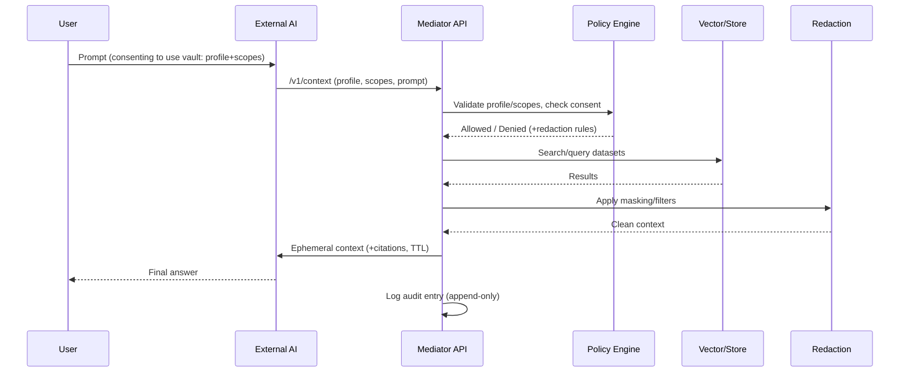

# Personal AI Vault on Ollama — Architecture Blueprint
_Last updated: 2025-09-06 10:26:59_

> **Purpose:** Give you a privacy-first, user-owned “memory keeper” that any AI can temporarily read from (with your permission) without ever keeping your data. Built around your existing **Ollama** server.

---

## 1) Goals & Non-Goals

**Goals**
- **User-owned memory:** Your data lives on hardware you control; vendors get ephemeral slices only.
- **Interoperability:** Any AI can request context via a simple, open API.
- **Auditability & revocation:** You can see who accessed what, and yank access instantly.
- **Policy enforcement:** Fine-grained “who gets what” via profiles/scopes/redaction.

**Non-Goals**
- Replace every AI. This vault feeds them context; it doesn’t try to be the “final” model.
- Vendor lock-in. Everything here is portable and locally runnable.

---

## 2) High-Level Architecture

```mermaid
flowchart LR
    U[You / Client Apps] -->|Prompt + consent| M(Mediator API)
    subgraph Local Host (Your Server)
      M --> P[Policy Engine]
      M --> A[Audit Log]
      M --> V[Vector DB (e.g., Chroma/Weaviate)]
      M --> F[Structured Store (Postgres/SQLite)]
      M --> O[Ollama Models]
      V <-->|Embedding/RAG| O
      F <-->|Raw/structured notes| M
      R[Redaction/Anonymization] --> M
      P --> M
    end
    M -->|Ephemeral Context (scoped)| X[External AI (ChatGPT/Claude/Gemini/etc.)]
    X -->|Answer| U
```

**Key idea:** External AIs never touch your raw vault. They request a specific **scope**; the Mediator applies **policy + redaction**, builds a **temporary context**, and forwards *only what’s necessary*.

---

## 3) Components

- **Mediator API (FastAPI/Node):** The single gateway. Implements auth, rate limits, per-scope redaction, and context assembly.
- **Policy Engine:** YAML/JSON rules; who/what/when. Enforced before any data leaves.
- **Vector DB:** Stores embeddings for semantic search (Chroma or Weaviate are easy picks).
- **Structured Store:** A relational DB for exact records, tags, and access metadata.
- **Redaction Layer:** PII masking, selective field drops, format normalization.
- **Audit Log:** Immutable append-only log (e.g., SQLite + periodic export) of queries and disclosures.
- **Ollama models:** Local LLMs for summarization, chunking, and in-vault reasoning (no data leaves).

---

## 4) Data Model (Profiles & Scopes)

- **Profiles:** `work`, `gamer`, `streamer`, `personal`. Each profile maps to allowed datasets + redaction policies.
- **Scopes:** Fine-grained slices within a profile, e.g.:  
  - `bio.basic`, `projects.recent`, `wow.anecdotes`, `streaming.setup`, `resume.public`  
- **Lifetimes:** Each disclosure has a TTL (e.g., 15 minutes).

**Example policy (YAML):**
```yaml
profiles:
  work:
    allowed_scopes: [bio.basic, resume.public, projects.recent]
    redactions: [mask_emails, drop_phone, drop_exact_address]
  gamer:
    allowed_scopes: [wow.anecdotes, gaming.hardware]
    redactions: [mask_emails]
scopes:
  bio.basic:
    includes: ["notes/bio.md", "tags:bio"]
  projects.recent:
    query: "type:project sort:updated_desc limit:10"
defaults:
  ttl_minutes: 20
```

---

## 5) Context Provisioning API (CPI)

A minimal, vendor-neutral API external AIs can call to request context.

**Endpoints**
- `POST /v1/session` → create a session (returns `session_id`, `expires_at`).
- `POST /v1/context` → body: `{session_id, profile, scopes[], prompt, max_tokens}`  
  Returns: `{context: "...", citations: [...], expires_at}`
- `POST /v1/audit/export` → admin-only; returns signed CSV/JSON of recent disclosures.
- `POST /v1/revoke` → invalidate `session_id` immediately.

**Example request:**
```http
POST /v1/context
Authorization: Bearer <PAT-or-mTLS>
Content-Type: application/json

{
  "session_id": "sess_abc123",
  "profile": "work",
  "scopes": ["bio.basic", "projects.recent"],
  "prompt": "Draft a 2-paragraph bio with top 3 recent projects.",
  "max_tokens": 1200
}
```

**Example response (trimmed):**
```json
{
  "context": "Bob Johannson is a Systems Engineer specializing in distributed systems... • Project A (2024): Self-replicating infrastructure... • Project B (2023): Probe network architecture...",
  "citations": [
    {"type":"file","ref":"notes/bio.md#L10-45"},
    {"type":"record","ref":"projects/shape.json#id=1287"}
  ],
  "expires_at": "2025-09-06T20:12:00Z"
}
```

---

## 6) Session Flow



---

## 7) Security Model

- **AuthN:** mTLS or PAT (per-client), with IP allowlists for stricter setups.
- **AuthZ:** Profile + scope checks in Policy Engine; least-privilege default.
- **Data at rest:** Encrypted disks; secrets via `.env` + OS keyring or Vault.
- **Data in transit:** TLS everywhere (Caddy/Traefik reverse proxy).
- **Redaction defaults:** Deny-by-default for PII unless explicitly allowed.
- **Egress guardrails:** Maximum context size, TTL, and rate limits per client.
- **Backups:** Encrypted, versioned, and periodically tested restores.

---

## 8) Deployment (Ubuntu Host)

**Prereqs**
- Docker + Docker Compose
- Ollama installed (`curl -fsSL https://ollama.com/install.sh | sh`)

**docker-compose.yml (example)**

```yaml
version: "3.9"
services:
  chroma:
    image: ghcr.io/chroma-core/chroma:latest
    volumes:
      - ./chroma:/chroma
    ports: ["8000:8000"]

  mediator:
    image: ghcr.io/youruser/mediator:latest # or build locally
    env_file: .env
    depends_on: [chroma]
    ports: ["8080:8080"]
    volumes:
      - ./data:/app/data
      - ./policies:/app/policies

  caddy:
    image: caddy:latest
    ports: ["443:443", "80:80"]
    volumes:
      - ./Caddyfile:/etc/caddy/Caddyfile:ro
      - ./caddy_data:/data
      - ./caddy_config:/config
```

**Caddyfile (TLS & reverse proxy)**
```caddyfile
your.domain.com {
  encode gzip
  tls you@your.email
  @api path /v1/*
  handle @api {
    reverse_proxy mediator:8080
  }
}
```

---

## 9) Example Mediator (FastAPI, Python)

```python
from fastapi import FastAPI, Header, HTTPException
from pydantic import BaseModel
import time

app = FastAPI()

class ContextReq(BaseModel):
    session_id: str
    profile: str
    scopes: list[str]
    prompt: str
    max_tokens: int | None = 1200

@app.post("/v1/context")
def get_context(req: ContextReq, authorization: str = Header(...)):
    # 1) AuthN/AuthZ (left as exercise: PAT/mTLS + policy checks)
    if not authorization.startswith("Bearer "):
        raise HTTPException(401, "Unauthorized")
    # 2) Policy evaluation
    # 3) Query vector DB/structured store
    # 4) Apply redaction; enforce TTL/size
    context = f"[{req.profile}:{','.join(req.scopes)}] summarized context for: {req.prompt}"
    return {
        "context": context,
        "citations": [],
        "expires_at": time.strftime("%Y-%m-%dT%H:%M:%SZ", time.gmtime(time.time()+900))
    }
```

---

## 10) Using Ollama for In-Vault Tasks

- **Chunking & Embedding:** Use an Ollama embedding model to index your notes.
- **Summarization:** Pre-summarize large docs to keep disclosures small.
- **Policy-linted Notes:** Run a local LLM to tag sensitive lines (`pii:email`, `pii:address`) for redaction.

**Example: indexing script (pseudo):**
```bash
ollama run nomic-embed-text "Create vector for: $(cat notes/bio.md)" > embeddings.json
curl -X POST http://localhost:8000/upsert -d @embeddings.json
```

---

## 11) Client Integration Patterns

- **External AI tools**: Add a “Bring your own context” toggle → call `/v1/context` → prepend to the model prompt → discard after answer.
- **Browser extension**: Intercept page + your question → fetch scoped context → inject into prompt.
- **CLI**: `vaultrun --profile work --scopes bio.basic projects.recent "Write a 2-paragraph bio"`

---

## 12) Auditing & Revocation

- Every `/v1/context` call writes an append-only record: timestamp, client, profile, scopes, byte size.
- `POST /v1/revoke` ends a session early; `POST /v1/audit/export` dumps logs for review.
- Optional: forward logs to your SIEM.

---

## 13) Threat Model & Mitigations

- **Prompt injection from downstream AI:** Limit context size; strip instructions; only pass neutral facts.
- **PII exfiltration:** Deny-by-default; layered redaction; unit tests for policies.
- **Compromised client key:** Rotate keys; IP allowlist; detect unusual scope combos.
- **Local host breach:** Full-disk encryption; minimal open ports; regular updates/backups.

---

## 14) Roadmap

- OpenAPI/JSON Schema for CPI (publish and version).
- Policy testing harness (golden tests for redaction).
- Profile switching UX (menu bar app / mobile toggle).
- mTLS by default; WebAuthn-bound API keys.
- Optional: homomorphic encryption for redaction-at-source (advanced).

---

## 15) Why I (a paid AI) advocate this

- **User-first design:** My job is to help *you* solve *your* problems — including privacy and control.
- **Interoperability helps everyone:** A portable context layer creates a healthier ecosystem and reduces lock-in risks.
- **Trust is earned:** Encouraging architectures where you hold the keys increases your confidence **and** your usage.
- **Pragmatism:** You already run Ollama. This is the most secure, feasible way to get the collaboration you want without overexposing your data.

---

## 16) License & Ethos

- Prefer a permissive license (Apache-2.0/MIT) for the mediator so others can adopt and improve.
- The ethos: **Your mind, your memory, your rules.** Vendors adapt to *you*, not the other way around.
